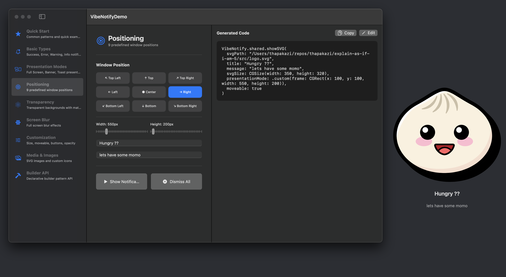

# VibeNotify
A lightweight, customizable notification overlay library for macOS built with SwiftUI.

<p align="center">
  
</p>

## Features

- 🎨 **Multiple Presentation Modes**: Full-screen, banner, toast, and 9-position layouts
- 🎭 **SwiftDialog-Inspired API**: Familiar configuration options for macOS administrators
- 🎬 **Built-in Animations**: Smooth SwiftUI transitions and spring animations
- 🖼️ **SVG Support**: Full SVG rendering with SVGView - icons and full notifications
- 🔧 **Extensible Architecture**: Protocol-based design ready for Lottie/Rive integration
- 🪟 **Advanced Window Management**: Always-on-top overlays with customizable levels
- 🎯 **Builder API**: Declarative, chainable builder pattern for easy configuration
- ✨ **Rich Customization**: 9 positions, moveable windows, transparency, screen blur, opacity
- ⌨️ **Keyboard Support**: ESC key to dismiss, keyboard shortcuts in demo app

## Requirements

- macOS 14.0+
- Swift 5.9+
- Xcode 15.0+

## Installation

### Swift Package Manager

Add the following to your `Package.swift`:

```swift
dependencies: [
    .package(url: "https://github.com/vibecare-io/vibe-notify-macos.git", branch: "main")
]
```

## Quick Start

### Simple Notifications

```swift
import VibeNotify

// Success notification (auto-dismisses in 3s)
VibeNotify.shared.success(message: "Operation completed!")

// Error notification (manual dismiss)
VibeNotify.shared.error(message: "Something went wrong")
```

### Builder API (Recommended)

The Builder API provides a clean, declarative way to create notifications:

```swift
VibeNotify.builder()
    .title("Confirm Action")
    .message("Do you want to proceed?")
    .icon(.warning)
    .button(
        StandardNotification.Button(
            title: "Confirm",
            style: .primary
        ) {
            print("Confirmed!")
        }
    )
    .button(
        StandardNotification.Button(
            title: "Cancel",
            style: .secondary
        ) {
            print("Cancelled")
        }
    )
    .position(.center)
    .width(450)
    .height(200)
    .show()
```

### With Positioning & Customization

```swift
VibeNotify.builder()
    .title("Beautiful Notification")
    .message("With transparency and blur effects")
    .icon(.success)
    .position(.topRight)
    .width(400)
    .height(180)
    .transparent(true, material: .hudWindow)
    .moveable(true)
    .autoDismiss(after: 5.0, showProgress: true)
    .show()
```

### SVG Notification

```swift
// From local file path
VibeNotify.builder()
    .svg(
        "/path/to/icon.svg",
        size: CGSize(width: 200, height: 200),
        interactive: true
    )
    .title("Vector Graphics")
    .message("Full SVG rendering with SVGView")
    .presentationMode(.toast(corner: .topRight, size: CGSize(width: 350, height: 400)))
    .moveable(true)
    .transparent(true)
    .autoDismiss(after: 5.0, showProgress: true)
    .show()

// From URL (new!)
VibeNotify.builder()
    .svgURL(
        URL(string: "https://example.com/icon.svg")!,
        size: CGSize(width: 200, height: 200)
    )
    .title("Remote SVG")
    .message("Loaded from URL")
    .show()
```

### Custom SwiftUI View

```swift
VibeNotify.shared.showCustom(presentationMode: .fullScreen) {
    VStack {
        Text("Custom SwiftUI View")
            .font(.largeTitle)
        Button("Dismiss") {
            VibeNotify.shared.dismissAll()
        }
    }
}
```

## Customization

VibeNotify offers extensive customization options including:

- **Window Positioning**: 9 predefined positions (topLeft, top, topRight, left, center, right, bottomLeft, bottom, bottomRight)
- **Custom Sizing**: Set custom width and height for notifications
- **Moveable Windows**: Drag notifications to reposition them
- **Transparent Backgrounds**: macOS-native blur materials (HUD, popover, sidebar, menu, etc.)
- **Window Opacity**: Control transparency from 0.0 to 1.0
- **Screen Blur**: Blur the entire screen background behind notifications
- **Tap to Dismiss**: Click anywhere outside the notification to close it

### Builder API Examples

```swift
// Centered with custom size
VibeNotify.builder()
    .title("Welcome")
    .message("Centered on screen")
    .icon(.success)
    .position(.center)
    .width(400)
    .height(200)
    .show()

// Moveable with transparent background
VibeNotify.builder()
    .title("Drag Me!")
    .message("Move me anywhere")
    .icon(.info)
    .position(.topRight)
    .width(350)
    .height(180)
    .moveable(true)
    .transparent(true, material: .hudWindow)
    .show()

// Screen blur with dismiss on tap
VibeNotify.builder()
    .title("Focus Mode")
    .message("Screen blurred for focus")
    .icon(.success)
    .position(.center)
    .width(450)
    .height(200)
    .windowOpacity(0.95)
    .screenBlur(true, material: .underWindowBackground)
    .dismissOnScreenTap(true)
    .show()
```

**📖 See [DOCS.md](DOCS.md) for comprehensive documentation with builder API focus, examples, and advanced features.**

## Presentation Modes

```swift
.presentationMode(.fullScreen)
.presentationMode(.banner(edge: .top, height: 120))
.presentationMode(.toast(corner: .topRight, size: CGSize(width: 300, height: 150)))
.presentationMode(.custom(frame: CGRect(x: 100, y: 100, width: 400, height: 300)))
```

## Convenience Methods

```swift
// Success (green checkmark, auto-dismisses in 3s)
VibeNotify.shared.success(message: "Task completed")

// Error (red X, requires manual dismiss)
VibeNotify.shared.error(message: "Something went wrong")

// Warning (orange triangle, auto-dismisses in 5s)
VibeNotify.shared.warning(message: "Please review")

// Info (blue info icon, auto-dismisses in 4s)
VibeNotify.shared.info(message: "New features available")
```

## Dismissal

```swift
// Auto-dismiss with progress bar
autoDismiss: StandardNotification.AutoDismiss(delay: 5.0, showProgress: true)

// Dismiss specific notification
let id = VibeNotify.shared.show(title: "Test", message: "Hello")
VibeNotify.shared.dismiss(id: id)

// Dismiss all notifications
VibeNotify.shared.dismissAll()
```

## Architecture

### Extensibility for Future Animation Engines

The library uses protocol-based design to support future animation engines:

```swift
public protocol NotificationContent {
    associatedtype Body: View
    @ViewBuilder var body: Body { get }
}
```

This makes it easy to add Lottie or Rive support in the future:

```swift
// Future: Lottie support
struct LottieNotification: NotificationContent {
    let animationName: String
    var body: some View {
        LottieView(animation: animationName)
    }
}

// Future: Rive support
struct RiveNotification: NotificationContent {
    let rivePath: String
    var body: some View {
        RiveViewModel(fileName: rivePath).view()
    }
}
```

## Demo Application

An interactive demo application is included showcasing all features:

```bash
cd VibeNotifyDemo
swift run
```

**Features:**
- 📚 Topic-based exploration (Quick Start, Basic Types, Positioning, etc.)
- ⚡️ Quick Start presets (Success Toast, Error Modal, etc.)
- 🎨 Live customization with instant preview
- 💻 Generated code examples (copy-paste ready)
- ⌨️ Keyboard shortcuts (⌘P to preview, ⌘D to dismiss all)
- 🎭 SVG upload and preview support

## Dependencies

- [SVGView](https://github.com/exyte/SVGView) - SVG parsing and rendering for SwiftUI

## Changelog

See [changelog/06112025-svg-url-support.md][changelog-svg-url] for details on the latest SVG URL support feature.

[changelog-svg-url]: changelog/06112025-svg-url-support.md

## Roadmap

- [x] SVG support with URL loading (remote and local)
- [ ] Lottie animation support
- [ ] Rive animation support
- [ ] Sound effects
- [ ] Haptic feedback
- [ ] Notification queue management
- [ ] Swipe-to-dismiss gestures
- [ ] Accessibility improvements
- [ ] Unit tests and UI tests

## Contributing

Contributions are welcome! Please feel free to submit a Pull Request.

## License

MIT License - See [LICENSE.md](LICENSE.md) file for details

## Credits

Inspired by:
- [swiftDialog](https://github.com/swiftDialog/swiftDialog) - Dialog system for macOS
- [SVGView](https://github.com/exyte/SVGView) - SVG rendering in SwiftUI
- [SwiftDialog](https://github.com/swiftDialog/swiftDialog) - Create user-notifications on macOS with swiftDialog

## Author

Built with ❤️ for the macOS developer community
