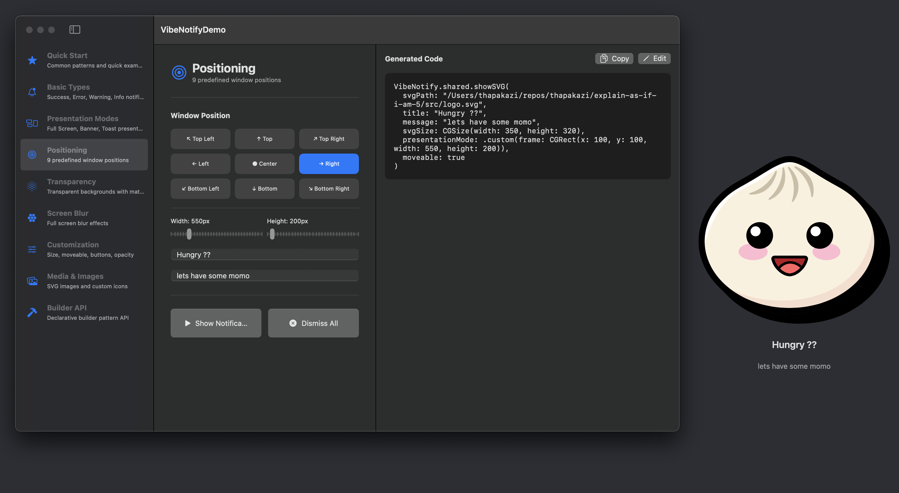

# VibeNotify
A notification overlay library for macOS: it draws the alert itself, in its own
borderless window, instead of handing a string to Notification Center.

<p align="center">
  
</p>

A **rich notification** is the one to reach for first. It is the only content
model that can carry an illustration, a row of buttons and a countdown *at the
same time* — the older `StandardNotification` has no illustration worth the
name (bitmaps are pinned to 48×48, SVG and URL icons draw nothing at all) and
`SVGNotification` has no `buttons` property, which is why `.svg(…).button(…)`
used to compile and silently drop every button.

```swift
import VibeNotify

VibeNotify.builder()
    .illustration(.symbol("eye", pointSize: 72, color: nil))
    .title("Look away")
    .message("Focus on something 20 feet away.")
    .taskTimer(TaskTimer(duration: 20, unitLabel: "seconds", completionLabel: "Break complete"))
    .button(StandardNotification.Button(title: "Done", style: .primary) {})
    .show()
```

That is a full-screen break alert with a 20-second ring: setting a task timer
without a `.mode(…)` upgrades the alert to `.interrupt`, because a labelled ring
is not drawn in `.ambient` and a ring nobody can see is not what the caller
asked for.

## Features

- 🖼️ **Rich Notifications**: Illustration + buttons + countdown on one surface, no card
- 🌐 **Web Panel**: Embed a live page beside the countdown — a game, a video, an inbox — so a break can *be* something instead of describing one
- ⏱️ **Countdowns The Library Owns**: A cancellable clock per overlay, not an `asyncAfter` in a view body
- 👁️ **Legibility By Construction**: White text is never drawn over a backdrop whose luminance is unknown
- 🎨 **Multiple Presentation Modes**: Full-screen, banner, toast, and 9-position layouts
- 🌘 **Break Backdrops**: Blur the desktop, or replace it with a painted field that is luminance-capped
- 🎭 **SwiftDialog-Inspired API**: Familiar configuration options for macOS administrators
- 🎬 **Built-in Animations**: Spring entrance, honouring Reduce Motion
- 🪟 **Advanced Window Management**: Always-on-top overlays with customizable levels
- 🎯 **Builder API**: Declarative, chainable builder pattern for easy configuration
- ⌨️ **Keyboard Support**: ESC key to dismiss, keyboard shortcuts in demo app

## Requirements

- macOS 14.0+
- Swift 6.1+ (the package declares `swift-tools-version: 6.1`)

## Installation

### Swift Package Manager

Add the following to your `Package.swift`:

```swift
dependencies: [
    .package(url: "https://github.com/vibecare-io/vibe-notify-macos.git", branch: "main")
]
```

## Quick Start

### Simple Notifications

```swift
import VibeNotify

// Success notification (auto-dismisses in 3s)
VibeNotify.shared.success(message: "Operation completed!")

// Error notification (manual dismiss)
VibeNotify.shared.error(message: "Something went wrong")
```

### Rich Notifications

The builder routes to the rich renderer on its own — see
[Rich vs. Standard routing](DOCS.md#which-renderer-runs) — but the model can
also be built and shown directly, which is what you want when the window
`Configuration` matters:

```swift
VibeNotify.shared.showRich(
    RichNotification(
        illustration: .symbol("figure.walk", pointSize: 72, color: nil),
        title: "Stand up",
        message: "Two minutes on your feet.",
        footnote: "Press ESC or click anywhere to skip",
        buttons: [
            StandardNotification.Button(title: "Done", style: .primary) {},
            StandardNotification.Button(title: "Skip", style: .secondary) {},
        ],
        taskTimer: TaskTimer(duration: 120, unitLabel: "seconds", completionLabel: "Nice."),
        mode: .interrupt
    ),
    configuration: .interrupt(dismissOnScreenTap: true)
)
```

`mode` and `configuration` travel together: `.interrupt` with
`Configuration.interrupt(…)`, `.ambient` with `Configuration.ambient(…)`. They
are two halves of one decision — the configuration builds the backdrop, and the
renderer chooses its text treatment on the assumption that backdrop is there.

An illustration can also be a fetched bitmap (`.image(NSImage, size:)`) or an
SVG (`.svg(SVGSource, size:)`). Whichever it is, an illustration too large for
its window is scaled down rather than pushing the rest of the alert out of the
frame.

### Builder API (Recommended)

The Builder API provides a clean, declarative way to create notifications:

```swift
VibeNotify.builder()
    .title("Confirm Action")
    .message("Do you want to proceed?")
    .icon(.warning)
    .button(
        StandardNotification.Button(
            title: "Confirm",
            style: .primary
        ) {
            print("Confirmed!")
        }
    )
    .button(
        StandardNotification.Button(
            title: "Cancel",
            style: .secondary
        ) {
            print("Cancelled")
        }
    )
    .position(.center)
    .width(450)
    .height(200)
    .show()
```

### With Positioning & Customization

```swift
VibeNotify.builder()
    .title("Beautiful Notification")
    .message("With transparency and blur effects")
    .icon(.success)
    .position(.topRight)
    .width(400)
    .height(180)
    .transparent(true, material: .hudWindow)
    .moveable(true)
    .autoDismiss(after: 5.0, showProgress: true)
    .show()
```

> `autoDismiss(after:showProgress:)` is deprecated in favour of
> `AutoDismiss(delay:indicator:)`, but it is still the *only* auto-dismiss the
> builder offers: a second overload with a defaulted trailing argument would
> make every existing call site ambiguous. Build the `AutoDismiss` yourself and
> pass it through `RichNotification` to reach `.hairlineRing`.

### SVG Notification (deprecated)

`SVGNotification` and `showSVG(…)` still work and still render exactly as they
did in 0.0.5, but they cannot express buttons or a footnote. Prefer
`RichNotification` with an `.svg` illustration.

```swift
// Still supported, unchanged
VibeNotify.builder()
    .svg("/path/to/icon.svg", size: CGSize(width: 200, height: 200))
    .title("Vector Graphics")
    .message("Full SVG rendering with SVGView")
    .show()

// The replacement: same SVG, plus a button that is not silently discarded
VibeNotify.builder()
    .svg("/path/to/icon.svg", size: CGSize(width: 200, height: 200))
    .title("Vector Graphics")
    .button(StandardNotification.Button(title: "OK", style: .primary) {})
    .show()
```

### Custom SwiftUI View

```swift
VibeNotify.shared.showCustom(presentationMode: .fullScreen) {
    VStack {
        Text("Custom SwiftUI View")
            .font(.largeTitle)
        Button("Dismiss") {
            VibeNotify.shared.dismissAll()
        }
    }
}
```

## Customization

VibeNotify offers extensive customization options including:

- **Window Positioning**: 9 predefined positions (topLeft, top, topRight, left, center, right, bottomLeft, bottom, bottomRight)
- **Custom Sizing**: Set custom width and height for notifications
- **Moveable Windows**: Drag notifications to reposition them
- **Transparent Backgrounds**: macOS-native blur materials (HUD, popover, sidebar, menu, etc.)
- **Window Opacity**: Control transparency from 0.0 to 1.0
- **Screen Blur**: Blur the entire screen background behind notifications
- **Tap to Dismiss**: Click anywhere outside the notification to close it

### Builder API Examples

```swift
// Centered with custom size
VibeNotify.builder()
    .title("Welcome")
    .message("Centered on screen")
    .icon(.success)
    .position(.center)
    .width(400)
    .height(200)
    .show()

// Moveable with transparent background
VibeNotify.builder()
    .title("Drag Me!")
    .message("Move me anywhere")
    .icon(.info)
    .position(.topRight)
    .width(350)
    .height(180)
    .moveable(true)
    .transparent(true, material: .hudWindow)
    .show()

// Screen blur with dismiss on tap
VibeNotify.builder()
    .title("Focus Mode")
    .message("Screen blurred for focus")
    .icon(.success)
    .position(.center)
    .width(450)
    .height(200)
    .windowOpacity(0.95)
    .screenBlur(true, material: .underWindowBackground)
    .dismissOnScreenTap(true)
    .show()
```

**📖 See [DOCS.md](DOCS.md) for comprehensive documentation with builder API focus, examples, and advanced features.**

## Presentation Modes

```swift
.presentationMode(.fullScreen)
.presentationMode(.banner(edge: .top, height: 120))
.presentationMode(.toast(corner: .topRight, size: CGSize(width: 300, height: 150)))
.presentationMode(.custom(frame: CGRect(x: 100, y: 100, width: 400, height: 300)))
```

## Convenience Methods

```swift
// Success (green checkmark, auto-dismisses in 3s)
VibeNotify.shared.success(message: "Task completed")

// Error (red X, requires manual dismiss)
VibeNotify.shared.error(message: "Something went wrong")

// Warning (orange triangle, auto-dismisses in 5s)
VibeNotify.shared.warning(message: "Please review")

// Info (blue info icon, auto-dismisses in 4s)
VibeNotify.shared.info(message: "New features available")
```

## Countdowns and Dismissal

Two different countdowns, deliberately not one:

- **`TaskTimer`** — the large labelled ring. It counts an exercise the user is
  meant to read and obey ("look away for 20 seconds"). `.interrupt` only.
- **`DismissIndicator`** — the quiet "this closes in N": `.bar`,
  `.hairlineRing`, or `.none`. It says the alert is going away, nothing more.

Set both and they run as **sequential phases**, total `duration + delay` — the
task runs first and alone, and the dismiss clock arms the moment it hits zero.
Earliest-deadline-wins was rejected because a habitual 5-second auto-dismiss
would silently kill a 20-second eye break at second five.

```swift
// Auto-dismiss with a draining bar
StandardNotification.AutoDismiss(delay: 5.0, indicator: .bar)

// Dismiss specific notification
let id = VibeNotify.shared.show(title: "Test", message: "Hello")
VibeNotify.shared.dismiss(id: id)

// Dismiss all notifications
VibeNotify.shared.dismissAll()
```

The clock is owned by `OverlayWindowManager`, not by a view body, so ESC, a
button and a click-away all cancel it — and it is injected into the SwiftUI
environment, so caller-supplied content passed to
`OverlayWindowManager.show(id:configuration:countdown:content:)` inherits a
countdown it can draw without asking for one. See
[DOCS.md](DOCS.md#notificationclock).

## Legibility

The invariant the rendering code is built around:

> Text is never rendered over a backdrop whose luminance we do not control.

`.interrupt` satisfies it by dimming the whole screen to `Legibility.safeDim`
(0.55 — the smallest dim at which white text clears WCAG AA 4.5:1 over a pure
white desktop) or by painting an opaque `BackdropStyle` field that is
luminance-capped at construction. `.ambient` satisfies it with a local feathered
scrim under its own text. Nothing reads `@Environment(\.colorScheme)` to decide
a colour — that answers a question about the OS, not about the pixels behind
the alert.

## Architecture

### Extensibility for Future Animation Engines

The library uses protocol-based design to support future animation engines:

```swift
public protocol NotificationContent {
    associatedtype Body: View
    @ViewBuilder var body: Body { get }
}
```

This makes it easy to add Lottie or Rive support in the future:

```swift
// Future: Lottie support
struct LottieNotification: NotificationContent {
    let animationName: String
    var body: some View {
        LottieView(animation: animationName)
    }
}

// Future: Rive support
struct RiveNotification: NotificationContent {
    let rivePath: String
    var body: some View {
        RiveViewModel(fileName: rivePath).view()
    }
}
```

## Demo Application

An interactive demo application is included showcasing all features:

```bash
cd VibeNotifyDemo
swift run
```

**Features:**
- 📚 Topic-based exploration (Quick Start, Basic Types, Positioning, etc.)
- ⚡️ Quick Start presets (Success Toast, Error Modal, etc.)
- 🎨 Live customization with instant preview
- 💻 Generated code examples (copy-paste ready)
- ⌨️ Keyboard shortcuts (⌘P to preview, ⌘D to dismiss all)
- 🎭 SVG upload and preview support

## Dependencies

- [SVGView](https://github.com/exyte/SVGView) - SVG parsing and rendering for SwiftUI

## Changelog

- [Rich notifications, countdowns and legibility][changelog-rich] — the current release
- [Adaptive theme support][changelog-theme]
- [SVG URL support][changelog-svg-url]

[changelog-rich]: changelog/16082026-rich-notifications.md
[changelog-theme]: changelog/30112025-adaptive-theme-support.md
[changelog-svg-url]: changelog/06112025-svg-url-support.md

## Roadmap

- [x] SVG support with URL loading (remote and local)
- [x] Rich notifications: illustration + buttons + countdown together
- [x] Reduce Motion and Reduce Transparency support
- [x] Unit tests (`swift test`)
- [ ] `moveable` and blur intensity reachable through the `AlertMode` factories ([#3](https://github.com/vibecare-io/vibe-notify-macos/issues/3))
- [ ] A non-ambiguous `indicator:` entry point on the builder
- [ ] Lottie animation support
- [ ] Rive animation support
- [ ] Sound effects
- [ ] Haptic feedback
- [ ] Notification queue management
- [ ] Swipe-to-dismiss gestures

## Contributing

Contributions are welcome! Please feel free to submit a Pull Request.

## License

MIT License - See [LICENSE.md](LICENSE.md) file for details

## Credits

Inspired by:
- [swiftDialog](https://github.com/swiftDialog/swiftDialog) - Dialog system for macOS
- [SVGView](https://github.com/exyte/SVGView) - SVG rendering in SwiftUI
- [SwiftDialog](https://github.com/swiftDialog/swiftDialog) - Create user-notifications on macOS with swiftDialog

## Author

Built with ❤️ for the macOS developer community
